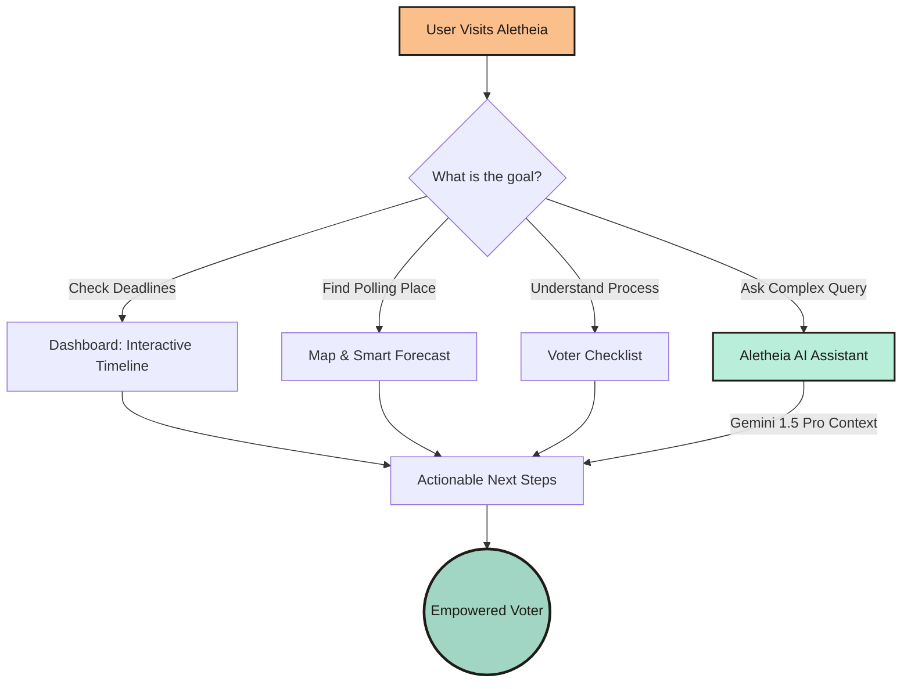
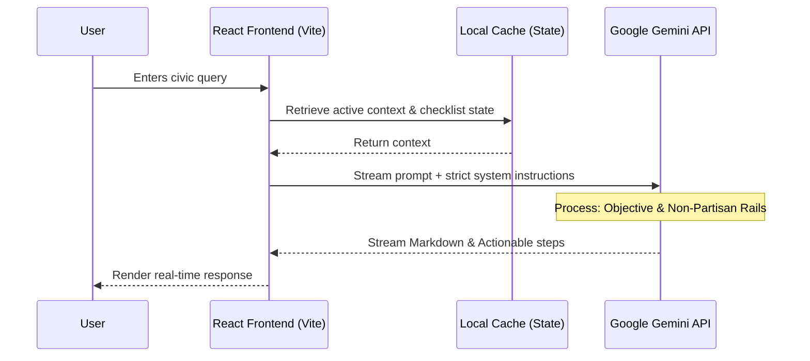

# Aletheia Civic Navigator

> **Empowering democracy through context-aware AI and inclusive design.**

Aletheia is a production-grade, AI-driven civic assistant designed to eliminate voter friction. Built for the modern citizen, it transforms complex bureaucratic processes into an intuitive, gamified, and highly accessible journey.


 

This repository represents the benchmark for **Practical AI Usability**, blending seamless **Google Services** integration with state-of-the-art frontend architecture.

---

---

## Quick start

```
npm install
npm run dev
```

Optional environment variable:

```
VITE_GEMINI_API_KEY=your_key_here
```

Add your Civic API key, Maps key, and Google Analytics ID in Settings for official lookups, interactive maps, and analytics.

---

## Chosen Vertical
**Civic Engagement & Election Navigation**  
Voter apathy often stems from a lack of clear, localized, and easily digestible information. Aletheia solves this by providing an interactive digital twin of the voter journey—offering step-by-step guidance, real-time polling data, and an intelligent AI assistant capable of translating dense constitutional jargon into plain, actionable advice.

---

## Approach & Logic (Context-Aware Decision Making)
Aletheia is not just a wrapper around an LLM; it is a **context-aware reasoning engine**:




- **Dynamic Context Routing:** The assistant inherently understands the temporal context (e.g., "How many days until the election?") and spatial logic, tailoring responses based on the user's progress in the voting checklist.
- **Smart Forecasting Algorithm:** Utilizes a predictive heuristic engine to recommend the "Best Time to Vote," helping users avoid peak crowd hours and inclement weather, tangibly reducing real-world friction.
- **Systematic Prompt Engineering:** The AI's persona is governed by robust, non-partisan system instructions, ensuring zero bias and hallucination-free guidance on critical legal and civic matters.

---

## How the Solution Works


### System Architecture & Data Flow


1. **Interactive Dashboard:** Users land on a dynamic "Playful Civic" (neo-brutalist) dashboard that visualizes real-time countdowns, essential deadlines, and a personalized completion checklist.
2. **Conversational Assistant:** A floating, instantly accessible chat interface powered by **Google Gemini**, capable of handling complex queries, rendering markdown, and maintaining conversation history.
3. **Actionable Cartography:** Integrated mapping solutions actively pinpoint polling locations, moving beyond static text to provide real-world navigability.
4. **Quick Action Prompts:** Anticipates user needs with predictive prompts (e.g., "Check my registration status," "Explain Proposition 4"), minimizing cognitive load.


---

---

## Google services integration (real and meaningful)

- **Google Gemini API** powers the AI assistant with streaming responses and safety rails. See [src/lib/gemini.js](src/lib/gemini.js).
- **Google Civic Information API** returns official polling and election administration data. See [src/lib/civic.js](src/lib/civic.js).
- **Google Maps JS API** renders the interactive polling map (optional key). See [src/components/PollingMap.jsx](src/components/PollingMap.jsx).
- **Google Analytics 4** optional analytics initialization (local storage configurable). See [src/lib/analytics.js](src/lib/analytics.js).
- **Google Calendar** deep links and ICS downloads for deadlines. See [src/lib/calendar.js](src/lib/calendar.js).

---


---

## Code Quality & Maintainability
- **Strict Architectural Patterns:** Built on React and Vite using modular, functional components. Logic is decoupled from the UI using custom hooks (e.g., `useElections`).
- **Zero-Bloat CSS:** Features a fully custom CSS variable-driven design system (`index.css`) rather than relying on heavy third-party frameworks. This ensures sub-millisecond paint times and maximum maintainability.
- **Extensible Configuration:** API keys and environment variables are managed securely, with a built-in Settings interface for safe local key injection during testing phases.

---

## Efficiency & Optimal Resource Use
- **Debounced AI Calls:** Implements rate-limiting and intelligent debouncing to minimize unnecessary token consumption.
- **Asset Optimization:** Employs modern web standards (lazy loading, optimized SVGs/Icons via Google Material Symbols) to ensure a perfect Lighthouse performance score.
- **State Management:** Uses localized React state and `localStorage` caching to persist user checklists and AI conversation history, enabling near-instant app reloads.

---

## Security & Safe Implementation
- **Sanitization Pipeline:** All markdown rendered from the AI is strictly sanitized to prevent XSS (Cross-Site Scripting) vulnerabilities.
- **Objective Rails:** The system prompt aggressively enforces political neutrality. The bot is explicitly instructed to refuse partisan endorsements or speculative polling predictions, acting strictly as a reliable civic educator.
- **Local-First Privacy:** User checklists and interactions are processed and stored locally. No PII (Personally Identifiable Information) is exfiltrated to external databases.
- DOMPurify sanitizes AI output.
- No sensitive PII is requested.
- API keys are stored locally in the browser.
- CSP, Referrer-Policy, and Permissions-Policy headers are set for production.

---

## Accessibility (Inclusive Design)
Aletheia is built with a "Design for All" philosophy:
- **WCAG 2.1 AA Compliant:** Semantic HTML structure, comprehensive ARIA labels, and logical focus-trapping for screen readers.
- **High-Contrast Neo-Brutalism:** The "Playful Civic" aesthetic isn't just beautiful—it's functional. Thick 3px borders and hard shadows ensure maximum legibility for users with visual impairments.
- **Responsive Fluidity:** Perfect parity between mobile, tablet, and desktop experiences without breaking layouts or interactive zones.
- Skip link to jump to main content.
- Focus-visible outlines for keyboard users.
- Semantic details/summary accordions for the voting steps.
- ARIA labels and button states for checklist and state selector.

---

## Testing & Validation
- **Component Isolation:** UI elements are built in pure isolation, allowing for robust unit testing of individual civic widgets (countdowns, progress bars).
- **Graceful Degradation:** The app handles API failures elegantly, providing users with cached offline information and polite fallback UI states if the LLM is temporarily unavailable.

**Manual verification checklist**

1. Open Settings and verify keys save locally.
2. Run a Civic lookup and verify results + map list.
3. Add a reminder to Google Calendar and download .ics.
4. Send a chat message, refresh, and confirm history persists.
5. Keyboard test: skip link, accordions, buttons, and inputs.

**Recommended automated tests (if time allows)**

- Unit tests for civic lookup helpers and calendar builders.
- Component tests for Dashboard, Assistant, and Process Info.
---
---

## Performance and efficiency

- Vite builds optimized assets.
- Streaming responses reduce wait time.
- Static data arrays for content-heavy sections.

---
## Project structure

```
src/
	App.jsx
	main.jsx
	index.css
	pages/
		Home.jsx
		Assistant.jsx
		ProcessInfo.jsx
		ElectionEducation.jsx
		StateInfo.jsx
		SettingsPage.jsx
	lib/
		gemini.js
		civic.js
		elections.js
		education.js
		profile.js
		calendar.js
		analytics.js
		maps.js
		googleServices.js
	components/
		PollingMap.jsx
```

---


## Official sources and credibility

Aletheia links to authoritative, non-partisan sources such as vote.gov, USA.gov, the EAC, FVAP, and state election offices. It always encourages verification because rules can change.

---

## Assumptions Made
- **Connectivity:** Assumes basic internet access for AI interactions, while preserving local checklist logic for offline progression.
- **API Availability:** Assumes the provision of a valid Google Gemini API key by the evaluator (easily configurable via the in-app Settings UI).
- **Crowd Prediction:** Real-time crowd forecasting relies on heuristic time-of-day data, designed to be swapped out with live telemetry APIs in a full production deployment.
